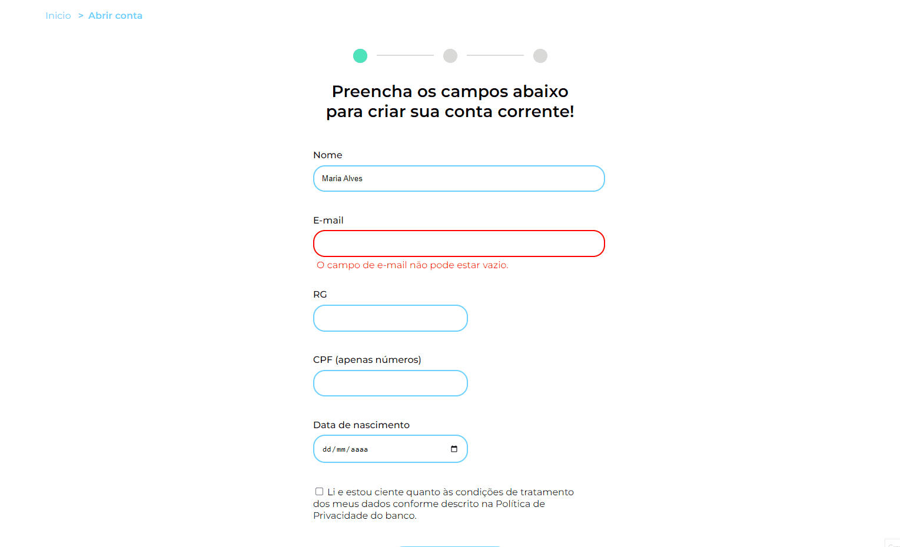

<h1>JavaScript: validando formulários | Alura</h1>

Repositório com material de estudo do curso "JavaScript: validando formulários" da Alura Escola Online de Tecnologia.

O commit inicial é referente ao projeto base, previamente disponibilizado pela instrutora do curso. 

A proposta deste treinamento é implementar validações nos campos do formulário, customizar mensagens de erros e criar um sistema de captura de imagem com JavaScript para reconhecimento facial.

<h2>:file_folder: Projeto MoniBank</h2>

O MoniBank é uma instituição financeira fictícia, que possui a funcionalidade de abertura de conta online.

Para abrir uma conta é preciso passar por três etapas. A primeira com um formulário para os dados pessoais dos clientes. A segunda com um sistema de reconhecimento facial. E a terceira com a finalização da abertura de conta.

  

 

Para as verificações mais simples foram usados atributos como required e minlength no próprio HTML. Já as verificações mais complexas como validação de dígitos do CPF foram implementadas com JavaScript.

Os dados desse formulário são armazenados no próprio navegador, através do localStorage.

E no código ainda é possível visualizar uma função assíncrona responsável por inicializar o vídeo para a captura da foto do sistema de reconhecimento facial.

<h2>:computer: Tecnologias utilizadas</h2>
  

    
    
    
   
